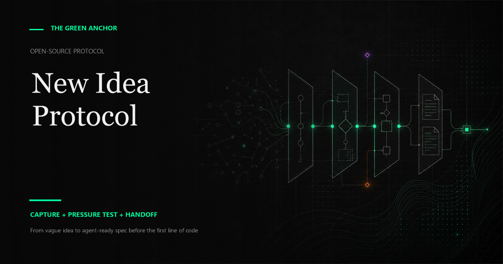

# New Idea Protocol

<p align="center">
  
</p>

<p align="center">
  <a href="https://github.com/thegreenanchor/new-idea-protocol/releases"></a>
  <a href="LICENSE"></a>
  <a href="adapters/"></a>
  <a href="https://github.com/thegreenanchor/new-idea-protocol/pulls"></a>
</p>

<p align="center"><b>From vague idea to agent-ready spec before the first line of code.</b></p>

<p align="center">
  <a href="#quick-start">Quickstart</a> | 
  <a href="PROTOCOL.md">Protocol</a> | 
  <a href="templates/">Templates</a> | 
  <a href="examples/personal-command-center/">Example</a> | 
  <a href="guides/">Guides</a> | 
  <a href="CREDIT.md">Credits</a>
</p>

`/new_idea` is requirements engineering for AI agents. It turns a rough app idea into a clarified MVP spec, assumption map, Wizard-of-Oz validation plan, and coding-agent handoff prompt before any code is written.

This is not a build command. It is a thinking command. It helps you stop asking AI to guess.

## Why this exists

Most AI coding failures start before code exists. The prompt is vague, the user flow is fuzzy, the agent fills blanks confidently, and the prototype becomes hard to maintain.

New Idea Protocol adds a small intake layer before implementation:

```text
vague idea
  -> raw idea capture
  -> maturity and type classification
  -> targeted blocking questions
  -> MVP and non-goals
  -> clarify + pressure test
  -> optional visual spec + Wizard-of-Oz validation plan
  -> coding-agent handoff
  -> implementation context
```

## Founder mode and engineer mode

**Founder mode:** clarify the problem, user, MVP promise, validation path, and what can be faked manually before spending build time.

**Engineer mode:** prevent architecture drift, scope creep, auth/data/security misses, and agent overreach before implementation.

## Outputs

Default artifact folder:

```text
ideas/001-my-idea/
  RAW-IDEA.md
  QUESTIONS.md
  SPEC.md
  ASSUMPTIONS.md
  DECISIONS.md
  WIZARD-OF-OZ.md
  HANDOFF.md
  VISUAL-SPEC.html   (optional, post-gates)
```

You can also keep those as sections in one Markdown spec if your workflow prefers a single document.

## Quick start

Copy the system prompt into your AI assistant:

```bash
cat prompts/00-system-instructions.md
```

Or scaffold the templates into an idea folder:

```bash
bash scripts/scaffold.sh ideas/001-my-idea
```

Then start with:

```text
/new_idea "I want to build a tool that turns messy voice notes into project specs and next actions."
```

## Lightweight gates

Before handoff, the protocol checks:

1. Problem is clear enough.
2. MVP scope is small enough.
3. Handoff prompt is implementation-ready.
4. Wizard-of-Oz path was considered.

Each gate should be marked `Pass`, `Pass with assumption`, `Decision required`, or `Deferred`.

## Wizard-of-Oz prototype

Optional Wizard-of-Oz prototype: a quick manual or semi-manual version of the experience so you can test the workflow before asking an agent to build the whole system.

Fake the expensive parts before you build them.

The prototype is not production code. It is a comprehension check: can the workflow be clicked through before anyone builds the real system?

## Visual spec

Optional visual spec: a styled, self-contained one-page HTML overview of the idea - MVP promise, scope vs non-goals, user flow, system design sketch, riskiest assumptions, and gate status. Judge the idea at a glance instead of re-reading Markdown.

Two rules keep it honest:

1. It is generated only after the four gates are recorded. Ideas that die in the pressure test die as plain text.
2. The Markdown spec stays the source of truth. The visual spec is a reading aid.

Start from `templates/VISUAL-SPEC.html` and restyle it to your own design system.

## How this differs from Spec Kit

Spec Kit is an implementation workflow for a project repo.

`/new_idea` is the intake workflow before a project repo exists.

Use `/new_idea` when the idea is still vague. Use Spec Kit, Seven-File Context, or your normal engineering process when the project is ready to become build artifacts.

## What not to use it for

Do not use this when:

- The task is a tiny bug fix.
- The project already has a clear spec.
- The user wants a quick one-off script.
- The right next step is research rather than product planning.
- The user explicitly wants to skip planning.

## Relationship to Seven-File Context

`/new_idea` is the intake protocol. Seven-File Context is the project memory system it can hand off to.

See: https://github.com/thegreenanchor/seven-file-context

## Repo map

- `PROTOCOL.md`: canonical public protocol.
- `prompts/`: copy-paste phase prompts.
- `templates/`: reusable output artifacts.
- `examples/personal-command-center/`: transcript-first example.
- `guides/`: anti-filler, path policy, and Spec Kit comparison.
- `adapters/`: tool-specific usage notes.
- `scripts/`: scaffold and validation helpers.

## License

MIT. See `LICENSE`.

## Credit

Created by Jose Suarez / The Green Anchor as part of a Hermes + Obsidian + coding-agent workflow.

Credit to JavaScript Mastery for the original AI-assisted development prompt/workflow Jose built from, and for the original six-file context methodology that Seven-File Context extends. See https://x.com/jsmasterypro and `CREDIT.md`.
